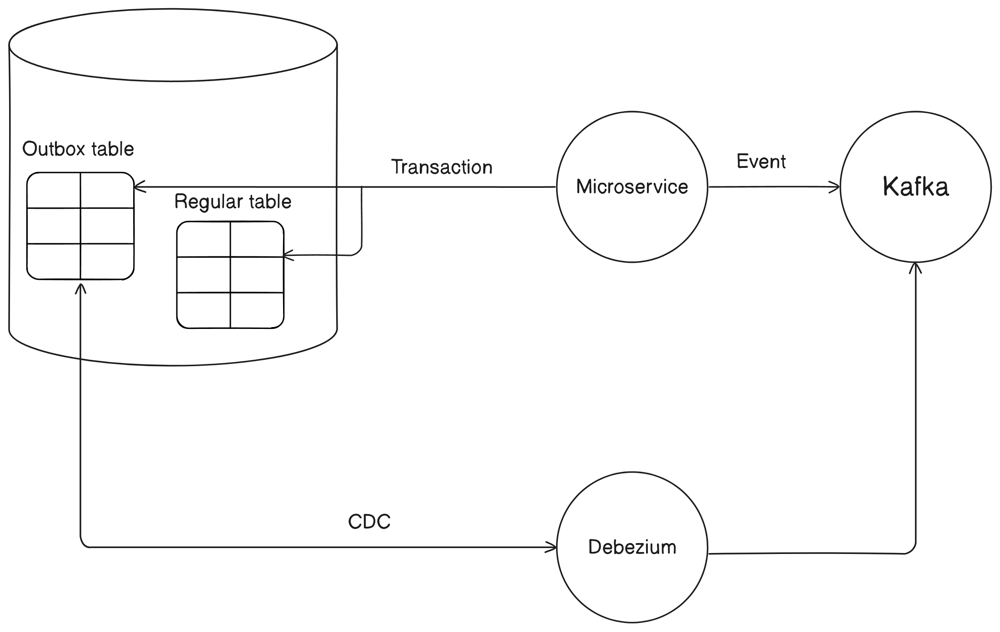
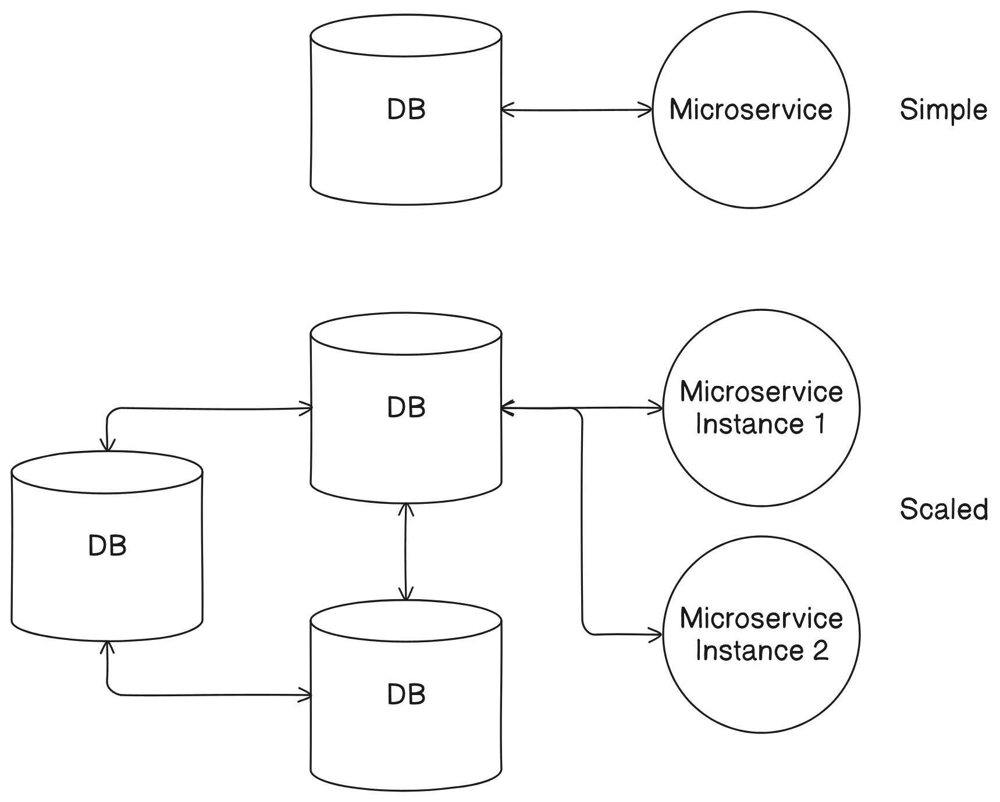
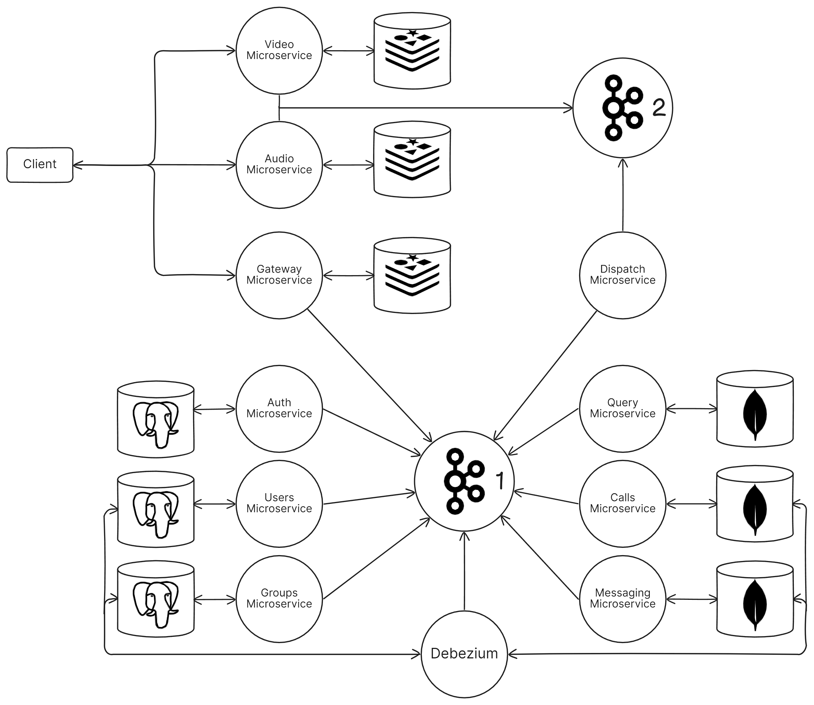

# Scaip a videoconference application

This project presents the design and implementation of a videoconference application with a microservices-oriented architecture. The communication between system components is event-based and implemented using Apache Kafka.

Microservices were identified based on entities and characteristics determined from existing market solutions. They were developed with an emphasis on isolation, so each microservice has its own database. Certain patterns were applied to the system to avoid inconsistencies and minimize interactions between microservices.

Practically, all microservices were developed using the Kotlin language and the Quarkus framework. The interface is a desktop client developed using the C++ language and the Qt framework, to have high control over video and audio capture. The videoconference was implemented in an unconventional way, using Apache Kafka.

## Design

### Establishing the microservices

The first step in identifying an initial set of microservices is to identify the main entities within the application. Users are at the center of the application and they can be organized into groups, so a microservice should be created for users and groups. Furthermore, users can communicate with each other through messages and videoconferences, thus a dedicated microservice for messaging and one for calls should be created.

The second step to identify another set of microservices is to determine how users can access and interact with the system. Therefore, the client application installed on the user's device must connect to the system and then the user can authenticate. From this, it results that a microservice is needed to manage system connections and a microservice to authenticate users and authorize the events they generate.

Another step would be to establish how the videoconference is managed. A videoconference consists of users that emit an audio and a video stream. In this case, a microservice for audio and one for video are needed.

Finally, a dedicated microservice should be created for routing events to the interested microservices and a microservice that behaves as a materialized view to avoid queries between microservices, which would create chatty behavior.

Therefore, ten microservices have been identified that need to be implemented:

1. Users Microservice
2. Groups Microservice
3. Messaging Microservice
4. Calls Microservice
5. Gateway Microservice
6. Auth Microservice
7. Audio Microservice
8. Video Microservice
9. Dispatch Microservice
10. Query Microservice

### Applied patterns

**The Outbox pattern** allows for updating the microservice's database and sending this event to the broker to be distributed to microservices. This pattern consists of three key components:

1. **Outbox Table**: The event just processed (an event that changes the content of the table or tables with the data of the entity managed by the microservice) is inserted here.
2. **Transaction**: A transaction on the entity tables and the Outbox table.
3. **CDC process**: A Change Data Capture process that monitors the Outbox table and publishes events to the broker.

**The Database per Service pattern** involves allocating a separate database for each microservice (if needed) within the architecture. This approach provides benefits such as:

- Isolation and independence of microservices
- Individual scalability for the associated database
- Direct access to the microservice's data by other microservices is blocked
- The ability to use multiple technologies for data storage

However, this pattern increases the system's complexity in terms of management and necessitates the implementation of additional mechanisms.

**The Event Sourcing pattern** involves storing data as a sequence of events, rather than the traditional method of storing only the current state of the data. Due to the use of Apache Kafka, this pattern naturally arises from the way the broker operates. Messages transmitted through Kafka are stored in an immutable event store, meaning they cannot be modified or deleted. The advantages of this pattern include:

- Reconstructing the system's state for disaster recovery or analyzing its state at specific points in time
- Creating a history that can be used for auditing or debugging

**The Materialized View pattern** involves the same concept as a Materialized View in databases, which means copying and arranging data from multiple tables to improve query performance. In the case of microservices architectures, microservices are implemented to gather data from various sources and store it in multiple formats to enhance query performance.

### The architecture

**WIP**
