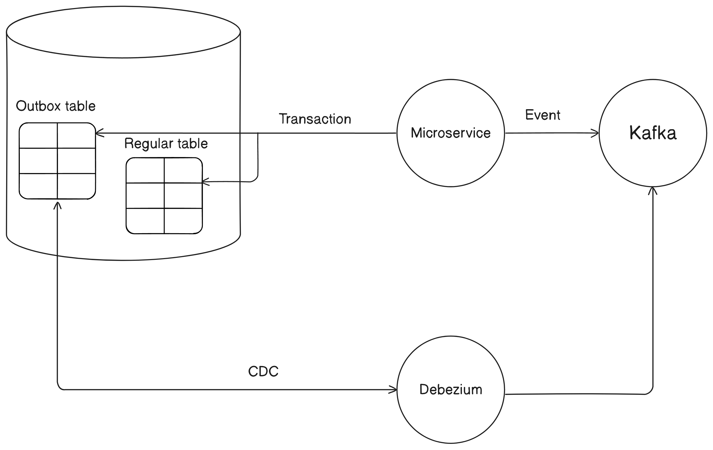
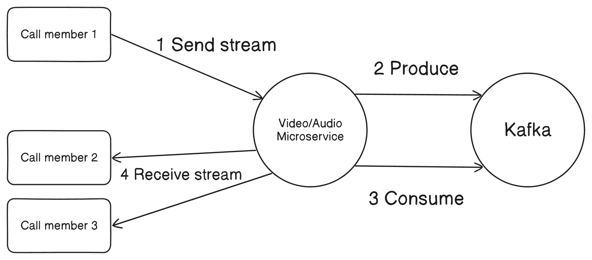
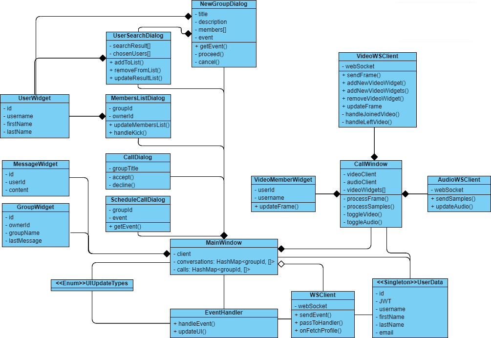
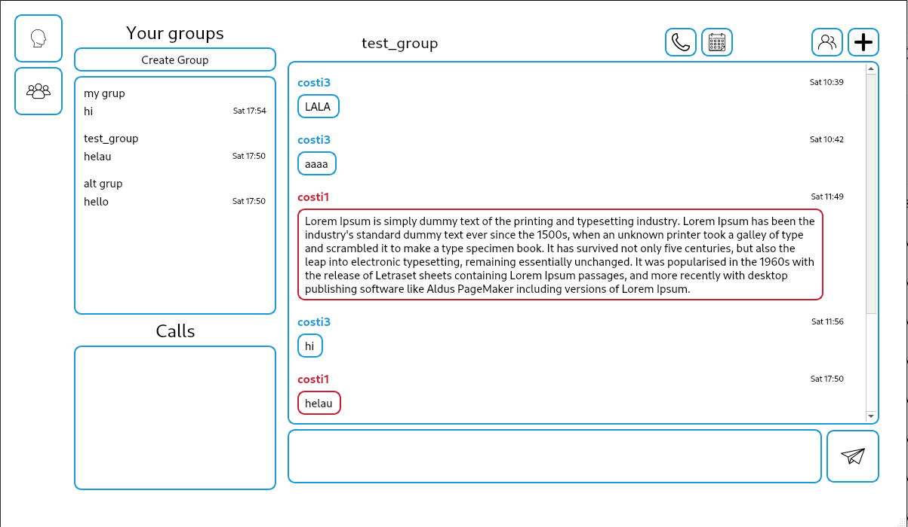
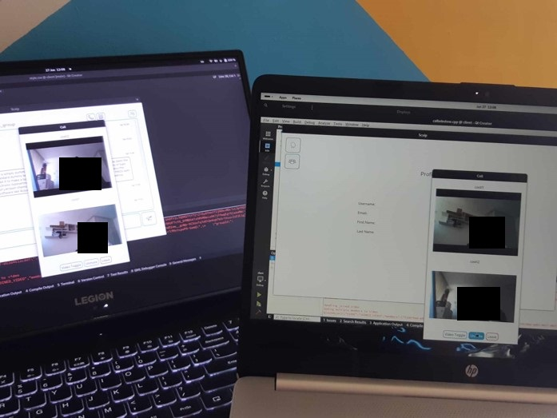

# Scaip a videoconference application

This project presents the design and implementation of a videoconference application with a microservices-oriented architecture. The communication between system components is event-based and implemented using Apache Kafka.

Microservices were identified based on entities and characteristics determined from existing market solutions. They were developed with an emphasis on isolation, so each microservice has its own database. Certain patterns were applied to the system to avoid inconsistencies and minimize interactions between microservices.

Practically, all microservices were developed using the Kotlin language and the Quarkus framework. The interface is a desktop client developed using the C++ language and the Qt framework, to have high control over video and audio capture. The videoconference was implemented in an unconventional way, using Apache Kafka.

## Design

### Establishing the microservices

The first step in identifying an initial set of microservices is to identify the main entities within the application. Users are at the center of the application and they can be organized into groups, so a microservice should be created for users and groups. Furthermore, users can communicate with each other through messages and videoconferences, thus a dedicated microservice for messaging and one for calls should be created.

The second step to identify another set of microservices is to determine how users can access and interact with the system. Therefore, the client application installed on the user's device must connect to the system and then the user can authenticate. From this, it results that a microservice is needed to manage system connections and a microservice to authenticate users and authorize the events they generate.

Another step would be to establish how the videoconference is managed. A videoconference consists of users that emit an audio and a video stream. In this case, a microservice for audio and one for video are needed.

Finally, a dedicated microservice should be created for routing events to the interested microservices and a microservice that behaves as a materialized view to avoid queries between microservices, which would create chatty behavior.

Therefore, ten microservices have been identified that need to be implemented:

1. Users Microservice
2. Groups Microservice
3. Messaging Microservice
4. Calls Microservice
5. Gateway Microservice
6. Auth Microservice
7. Audio Microservice
8. Video Microservice
9. Dispatch Microservice
10. Query Microservice

### Applied patterns

**The Outbox pattern** allows for updating the microservice's database and sending this event to the broker to be distributed to microservices. This pattern consists of three key components:

1. **Outbox Table**: The event just processed (an event that changes the content of the table or tables with the data of the entity managed by the microservice) is inserted here.
2. **Transaction**: A transaction on the entity tables and the Outbox table.
3. **CDC process**: A Change Data Capture process that monitors the Outbox table and publishes events to the broker.

**The Database per Service pattern** involves allocating a separate database for each microservice (if needed) within the architecture. This approach provides benefits such as:

- Isolation and independence of microservices
- Individual scalability for the associated database
- Direct access to the microservice's data by other microservices is blocked
- The ability to use multiple technologies for data storage

However, this pattern increases the system's complexity in terms of management and necessitates the implementation of additional mechanisms.

**The Event Sourcing pattern** involves storing data as a sequence of events, rather than the traditional method of storing only the current state of the data. Due to the use of Apache Kafka, this pattern naturally arises from the way the broker operates. Messages transmitted through Kafka are stored in an immutable event store, meaning they cannot be modified or deleted. The advantages of this pattern include:

- Reconstructing the system's state for disaster recovery or analyzing its state at specific points in time
- Creating a history that can be used for auditing or debugging

**The Materialized View pattern** involves the same concept as a Materialized View in databases, which means copying and arranging data from multiple tables to improve query performance. In the case of microservices architectures, microservices are implemented to gather data from various sources and store it in multiple formats to enhance query performance.

### The architecture

- ***Kafka 1*** - General Kafka cluster for communication between microservices.
- ***Kafka 2*** - Dedicated Kafka cluster for the Video Microservice and Audio Microservice. Stores audio and video streams for each call in topics.
- ***Gateway Microservice*** - Manages WebSocket connections to the application.
- ***Video Microservice*** - Manages WebSocket connections for the video streams in calls.
- ***Audio Microservice*** - Manages WebSocket connections for the audio streams in calls.
- ***Auth Microservice*** - Handles user authentication and authorization logic.
- ***Users Microservice*** - Manages user data creation and updates.
- ***Groups Microservice*** - Manages group creation and user membership in groups.
- ***Query Microservice*** - Handles logic for retrieving the authenticated user's data and other entities, such as groups or other users.
- ***Calls Microservice*** - Manages logic for initiating instant or scheduled calls.
- ***Messaging Microservice*** - Handles logic for sending text messages in groups and retrieving them in a paginated manner.
- ***Dispatch Microservice*** - Manages logic for propagating events generated by microservices or the client to interested microservices.
- ***Debezium*** - Performs Change Data Capture (CDC) on Outbox collections or tables in the databases it interacts with.
- ***Client*** - Desktop application that communicates with the system via WebSocket.

The client can connect to three microservices: Gateway, Video, and Audio. By default, it connects to the Gateway and only connects to Video and Audio during calls. These three microservices use Redis as a database to store simple data, such as which users are in a certain group. Auth, Users, and Groups use PostgreSQL because they manage data with a fixed schema, while Query, Calls, and Messaging use MongoDB to store data with a more flexible schema.

It can be observed that the Outbox pattern was applied to the Users, Groups, Messaging, and Calls microservices because they create new data in the system, and inconsistencies must be avoided for such important events.

### The videoconference

This is the experimental and unconventional part of the project. I attempted to implement the videoconference using Kafka due to its high throughput and an idea where the videoconference could be downloaded after it ends, similar to how matches can be downloaded in League of Legends or Dota 2.

The overall result was quite poor because I'm new to Kafka and event-driven architectures and didn't know what to expect. The videoconference itself has problems such as lack of synchronization, delays, and the inability for two members of the call to be heard simultaneously. Here's how it works:

1. The video or audio stream is sent to the respective microservice via WebSocket.
2. The receiving microservice puts the received data in the video or audio topic specific to that call.
3. The microservice pools data from the topic for 1 second.
4. The data is sent to the members of the call.

Even though the result was not ideal, I believe that implementing a videoconference through Kafka is achievable at a more acceptable level with more time and resources dedicated to developing a better algorithm. I plan to revisit this idea in the future as I gain more experience in software engineering and potentially seek guidance from experts in video/audio streaming.

### The structure of a microservice

All microservices were developed using Kotlin and the Quarkus framework, and they follow a similar structure. Each microservice has a main class that consumes events from Kafka, which are then passed to handler functions. Database interactions are managed through repository classes, and microservices using the Outbox Pattern also include an Outbox Repository. Additionally, each microservice has an `Event` enum that defines all the handled and resulting events.

### The structure of the UI

Below is the class diagram for the implementation of the client application in C++ using the Qt framework:

The MainWindow and CallWindow classes represent the main windows of the application, where users can interact using features such as chat and video conferencing. The NewGroupDialog, UserSearchDialog, MembersListDialog, CallDialog, and ScheduleCallDialog classes are secondary windows of the application that facilitate functionalities like creating a group, searching for users, call notifications, and scheduling a meeting.

The UserWidget, MessageWidget, GroupWidget, and VideoMemberWidget classes represent graphical components used in both main and secondary windows to display information from a group or video call.

The WSClient, VideoWSClient, and AudioWSClient classes are used to connect the application to the system. WSClient is used for general connection, while VideoWSClient and AudioWSClient are used for connecting to a call.

The EventHandler class is used to handle events received through WSClient and determine how the window represented by MainWindow is updated (UIUpdateTypes).

The UserData class is a singleton used to access the authenticated user's data anywhere in the application.

It is worth mentioning that not all attributes and methods present in the implementation have been added to the classes in the diagram, as some classes contain a large number of methods and attributes, which would clutter the diagram.

